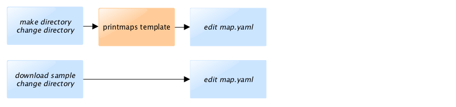
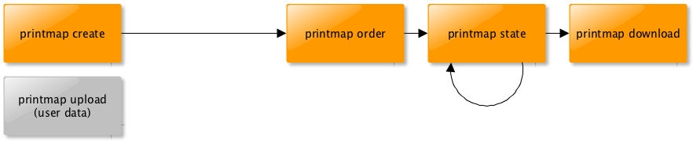
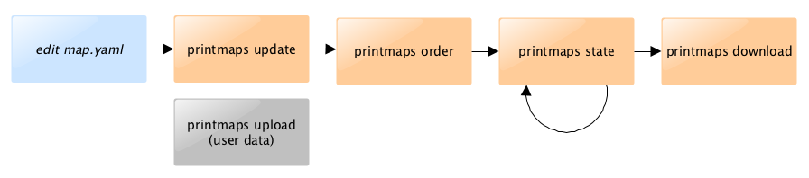

# CLI Client

Der universelle Client "printmap" stellt ein Command-Line-Interface für die Nutzung des Webservice "printmaps_webservice" bereit. Wie der Client zu benutzen ist, wird detailliert auf der entsprechenden Webseite erläutert.

Der CLI-Client ist eine von vielen Möglichkeiten das JSON-API des Webservices anzusprechen.
Weitere Varianten wären zum Beispiel Web-Applikationen oder auch Tools wie curl und wget.

Um sich mit den Möglichkeiten von Printmaps vertraut zu machen, empfiehlt sich jedoch zunächst
die Nutzung des CLI-Clients. Damit läßt sich in kurzer Zeit eine jederzeit reproduzierbare Karte erzeugen.

### Workflow: Karte definieren oder Beispiel laden

### Workflow: Karte erzeugen

### Workflow: Karte verbessern

---

to be done - english translation
