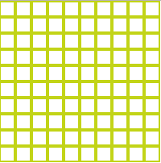

# Patterns 2

Das Utilityprogramm "printmaps_patterns2" erzeugt ein Set an SVG-Pattern (Schraffuren, Raster, Punkte, ...), die für kartografische Zwecke hilfreich sind. Beispiel:

    <?xml version='1.0' encoding='UTF-8'?>
    <svg xmlns='http://www.w3.org/2000/svg' xmlns:xlink='http://www.w3.org/1999/xlink' style='isolation:isolate' viewBox='0 0 200 200' width='200'  height='200'>
    <line x1='0' y1='0' x2='0' y2='200' stroke-width='4' stroke='#C2D417' />
    <line x1='20' y1='0' x2='20' y2='200' stroke-width='4' stroke='#C2D417' />
    <line x1='40' y1='0' x2='40' y2='200' stroke-width='4' stroke='#C2D417' />
    <line x1='60' y1='0' x2='60' y2='200' stroke-width='4' stroke='#C2D417' />
    <line x1='80' y1='0' x2='80' y2='200' stroke-width='4' stroke='#C2D417' />
    <line x1='100' y1='0' x2='100' y2='200' stroke-width='4' stroke='#C2D417' />
    <line x1='120' y1='0' x2='120' y2='200' stroke-width='4' stroke='#C2D417' />
    <line x1='140' y1='0' x2='140' y2='200' stroke-width='4' stroke='#C2D417' />
    <line x1='160' y1='0' x2='160' y2='200' stroke-width='4' stroke='#C2D417' />
    <line x1='180' y1='0' x2='180' y2='200' stroke-width='4' stroke='#C2D417' />
    <line x1='200' y1='0' x2='200' y2='200' stroke-width='4' stroke='#C2D417' />
    <line x1='0' y1='0' x2='200' y2='0' stroke-width='4' stroke='#C2D417' />
    <line x1='0' y1='20' x2='200' y2='20' stroke-width='4' stroke='#C2D417' />
    <line x1='0' y1='40' x2='200' y2='40' stroke-width='4' stroke='#C2D417' />
    <line x1='0' y1='60' x2='200' y2='60' stroke-width='4' stroke='#C2D417' />
    <line x1='0' y1='80' x2='200' y2='80' stroke-width='4' stroke='#C2D417' />
    <line x1='0' y1='100' x2='200' y2='100' stroke-width='4' stroke='#C2D417' />
    <line x1='0' y1='120' x2='200' y2='120' stroke-width='4' stroke='#C2D417' />
    <line x1='0' y1='140' x2='200' y2='140' stroke-width='4' stroke='#C2D417' />
    <line x1='0' y1='160' x2='200' y2='160' stroke-width='4' stroke='#C2D417' />
    <line x1='0' y1='180' x2='200' y2='180' stroke-width='4' stroke='#C2D417' />
    <line x1='0' y1='200' x2='200' y2='200' stroke-width='4' stroke='#C2D417' />
    </svg>

Die erzeugten Pattern können uneingeschränkt mit mapnik verwendet werden.
Die Namen aller Patterns unterliegen einem bestimmten Schema und beginnen immer mit dem (reservierten) Bezeichner "Printmaps_".
Die Patterns sollten, zusammen mit allen Printmaps_-Icons, in ein Verzeichnis "markers" kopiert werden.
Dieses Verzeichnis ist dem Buildservice bekannt zu machen (printmaps_buildservice.yaml).

Siehe auch "Patterns 1".

---

to be done - english translation
